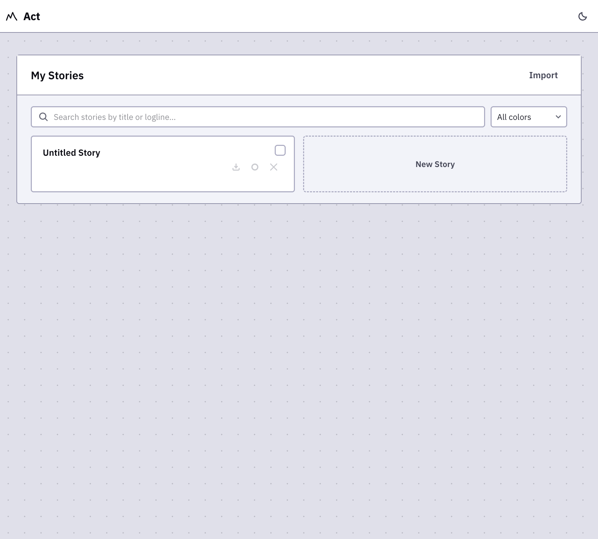
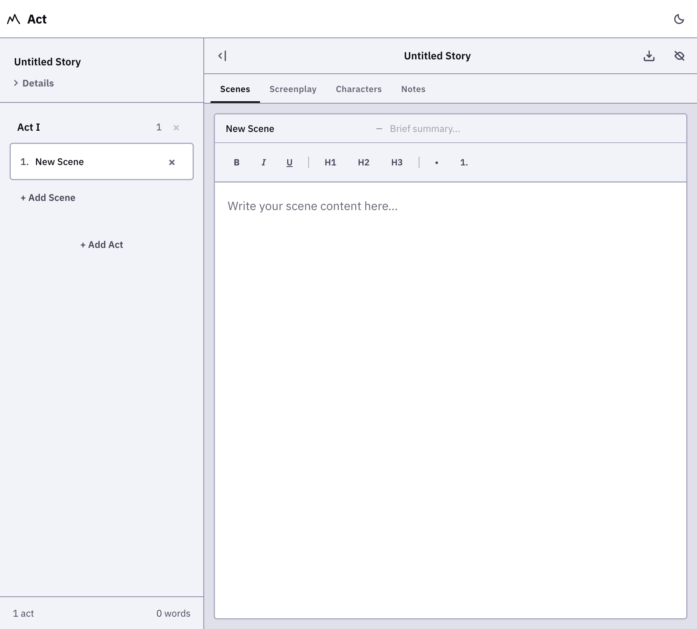
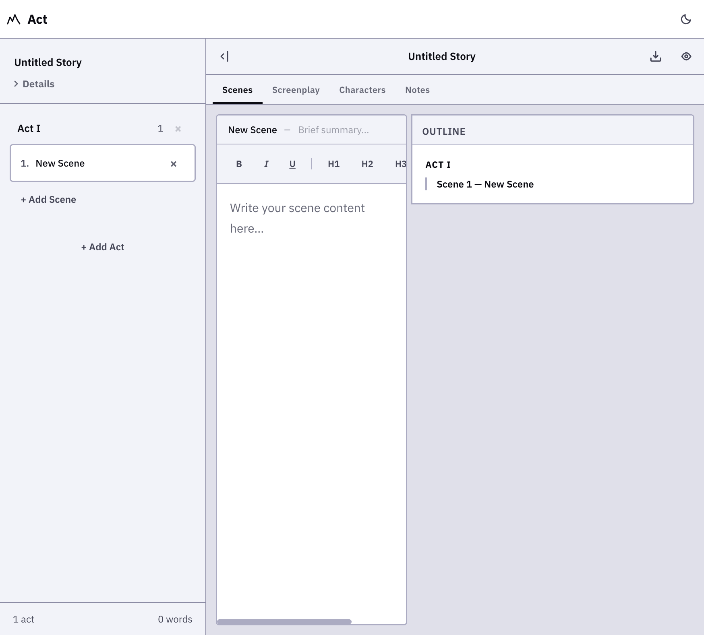
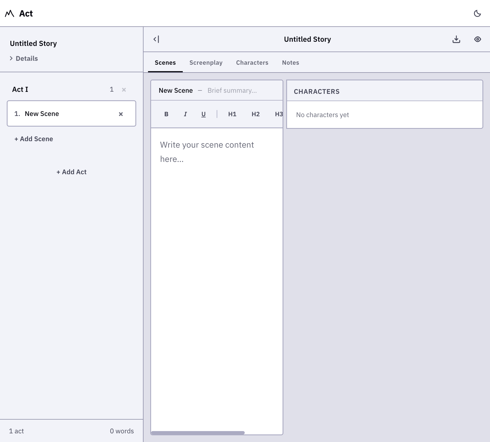
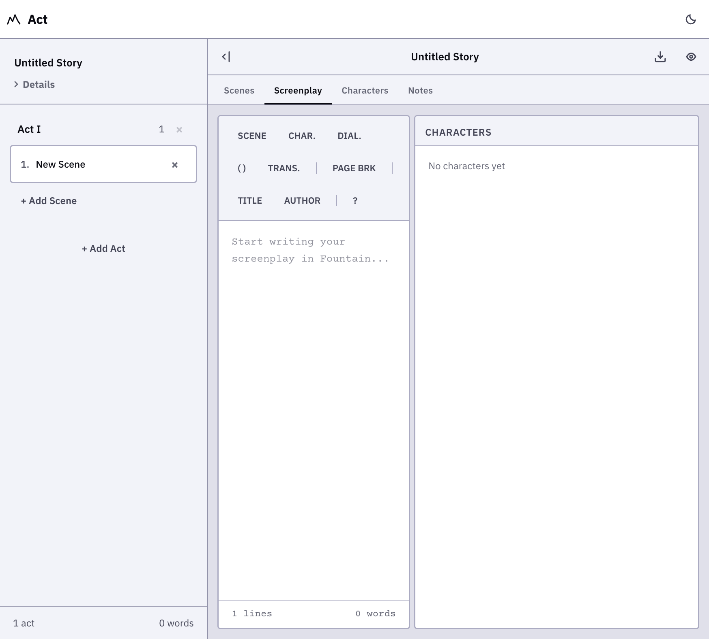
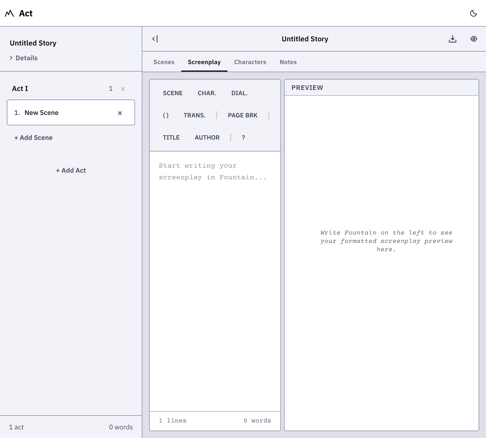

# Act — Story Builder

[](https://act.pages.dev)
[](https://kit.svelte.dev)

A modern, **local-first** writing app for screenwriters and storytellers. Build stories from templates or a blank page, manage characters and scenes, write in Fountain syntax, preview as a formatted screenplay — all in your browser, all offline.

[Visit Act now.](https://act.cwright-293.workers.dev/)

## Features

📐 **Story Templates** — Start with a blank slate or one of six built-in story structures: Three-Act, Hero's Journey, Save the Cat, Freytag's Pyramid, 7-Point, or blank. Each comes with pre-written scene titles and summaries to scaffold your outline.

✍️ **Four Editing Modes** — Switch between **Scenes** (rich-text per scene), **Screenplay** (Fountain plain-text with syntax highlighting), **Characters** (inline-editable cards), and **Notes** (story-level rich text) via tabs at the top of the editor panel.

📄 **Live Fountain Preview** — Write in industry-standard Fountain format and see it rendered as a proper screenplay in real-time. An inline help panel covers all 12 rules.

📊 **Outline & Character Previews** — Cycle the right panel through **closed**, **outline** (condensed act/scene summary), and **characters** (all characters at a glance) with a single toggle. In Screenplay mode, the cycle includes the **Fountain preview** between closed and outline.

🔒 **Privacy First** — Zero data ever leaves your device. No accounts, no sign-ups, no tracking, no cloud sync. All data stays in your browser's IndexedDB.

↔️ **Resizable Panels** — Drag the handle between editor and preview to reclaim space. Works with mouse, touch, and keyboard (ArrowLeft / ArrowRight).

🔄 **Drag & Drop Reordering** — Drag scenes within an act or across acts to restructure your story. Visual drop indicators show exactly where a scene will land.

📤 **Export & Import** — Export as **Markdown**, **PDF**, **Fountain**, or **.act** (portable JSON envelope with auto-ID regeneration on import). Download individual screenplays directly from the dashboard.

🎨 **Light, Dark & OLED Modes** — Three carefully crafted themes for any environment. Switches are instant.

📱 **Mobile-Friendly** — Panels stack vertically on narrow screens, touch targets are 44px+ on coarse pointers, safe areas are respected, and the Fountain preview is toggleable to maximize editing space.

⚡ **Instant Responsiveness** — All saves, reorders, and mode switches happen in the same frame. No spinners, no waiting.

## Screenshots

| Dashboard | Scenes Editor |
|---|---|
|  |  |

| Outline Preview | Characters Preview |
|---|---|
|  |  |

| Screenplay Mode | Fountain Preview |
|---|---|
|  |  |

## Getting Started

### Prerequisites

- **Node.js** 18+ and **npm** (or yarn/pnpm)

### Installation

```bash
# Clone the repo
git clone https://github.com/yourusername/act.git
cd act

# Install dependencies
npm install

# Start the dev server
npm run dev

# Open in your browser
# http://localhost:5173
```

Or open with `npm run dev -- --open` to auto-launch the app.

## Development

### Available Commands

```bash
# Start dev server with hot reload
npm run dev

# Type-check Svelte components and files
npm run check

# Type-check in watch mode
npm run check:watch

# Build for production
npm run build

# Preview production build locally
npm run preview

# Build for Cloudflare Pages
npm run cf-build
```

### Project Structure

```
act/
├── src/
│   ├── routes/                # SvelteKit pages (dashboard, story editor)
│   ├── lib/
│   │   ├── components/        # Reusable UI components
│   │   │   ├── CharacterPanel.svelte     # Character management with inline editing
│   │   │   ├── CharactersPreview.svelte  # Shared character-overview card
│   │   │   ├── FountainEditor.svelte     # Syntax-highlighted Fountain editor
│   │   │   ├── FountainPreview.svelte    # Formatted screenplay preview
│   │   │   ├── NotesEditor.svelte        # TipTap rich-text notes editor
│   │   │   ├── OutlinePreview.svelte     # Shared story-outline card
│   │   │   ├── SceneEditor.svelte        # TipTap rich-text editor per scene
│   │   │   └── TemplatePicker.svelte     # Modal dialog for story templates
│   │   ├── domain/            # Core story logic
│   │   │   ├── story.ts       # Types & factories (Story, Act, Scene, Character, Screenplay)
│   │   │   └── templates.ts   # 6 built-in template definitions + factory
│   │   ├── persistence/       # IndexedDB database layer (Dexie)
│   │   ├── stores/            # Svelte stores (theme, app state)
│   │   ├── export/            # Markdown, PDF, Fountain, .act export
│   │   └── import/            # .act file import with ID regeneration
│   └── app.css                # Global styles, design tokens, Tailwind v4
├── static/                    # Static assets
├── svelte.config.js           # SvelteKit configuration
├── vite.config.ts             # Vite bundler config
├── tailwind.config.js         # Tailwind CSS config
└── wrangler.toml              # Cloudflare Pages config
```

## Tech Stack

### Frontend Framework & Build

- **[SvelteKit](https://kit.svelte.dev)** — Full-featured framework for building fast web apps
- **[Svelte 5](https://svelte.dev)** — Reactive UI with minimal boilerplate (runes mode)
- **[Vite](https://vitejs.dev)** — Lightning-fast build tool and dev server
- **[TypeScript](https://www.typescriptlang.org)** — Static typing for safety

### Styling & UI

- **[Tailwind CSS 4](https://tailwindcss.com)** — Utility-first CSS for rapid design
- **[Tailwind Typography](https://github.com/tailwindlabs/tailwindcss-typography)** — Prose styling for rich-text content
- **IBM Plex Sans** — Warm, humanist sans-serif typeface throughout
- **Courier Prime** — Monospace typeface for Fountain screenplay text

### Editor & Content

- **[TipTap](https://www.tiptap.dev)** — Headless rich-text editor (bold, italic, lists, headings)
- **[ProseMirror](https://prosemirror.net)** — Underlying rich-text engine for TipTap
- **[Fountain.js](https://github.com/mattduvall/fountain-js)** — Parse & render Fountain screenplay syntax
- **[Turndown](https://github.com/domchristie/turndown)** — Convert HTML to Markdown
- **[jsPDF](https://github.com/parallax/jsPDF)** — Generate PDFs in the browser

### Data & Storage

- **[Dexie.js](https://dexie.org)** — IndexedDB wrapper for client-side persistence
- **[nanoid](https://github.com/ai/nanoid)** — Tiny, secure unique ID generator

### Deployment

- **[Cloudflare Pages](https://pages.cloudflare.com)** — Static site hosting with zero-config deployment

## Deployment

Act is ready to deploy to **Cloudflare Pages** (or any static host).

### Deploy to Cloudflare Pages

1. Push to GitHub:
   ```bash
   git push origin main
   ```

2. Connect your repo in [Cloudflare Pages Dashboard](https://pages.cloudflare.com)
   - Build command: `npm run cf-build`
   - Build output directory: `build`

3. Deploy on every push — automatic!

### Other Platforms

Act works on any static host:
- **Vercel** — Set build to `npm run build`, output to `build`
- **Netlify** — Same as above
- **GitHub Pages** — Same as above

## Design Principles

1. **Words come first** — The editor never gets between you and your writing.
2. **Instant response** — Every action completes immediately. Autosave is silent.
3. **Structure as guide** — Templates and acts are optional scaffolding, not a cage.
4. **Accessibility** — WCAG AA compliant, dark mode, keyboard navigation, reduced motion support, large touch targets.
5. **No clutter** — Every element earns its place.
6. **Zero data transmission** — The app makes no network requests (except optional font loading). Your work never leaves your device.

See [DESIGN.md](DESIGN.md) for the full design system, color palette, and component specifications.

## Privacy

Act is built from the ground up as a **local-first** application:

- **No accounts or sign-ups** — No registration, no login wall.
- **No cloud sync** — All data persists in your browser's IndexedDB.
- **No analytics or tracking** — No cookies, no telemetry, no third-party scripts.
- **Optional external requests** — Google Fonts (Courier Prime) can be removed or self-hosted for a fully offline experience.
- **Hardened deployment** — Deploy with a Content Security Policy for defense-in-depth (see `_headers`).

## Browser Support

Act works on all modern browsers:
- Chrome/Edge 90+
- Firefox 88+
- Safari 14+
- Opera 76+

IndexedDB is required for local persistence.

## Contributing

Contributions welcome! Please feel free to submit a Pull Request.

Before submitting:
- Run `npm run check` to type-check
- Test in dev mode with `npm run dev`
- Ensure your changes are tested

## License

This project is licensed under the MIT License — see [LICENSE](LICENSE) for details.
