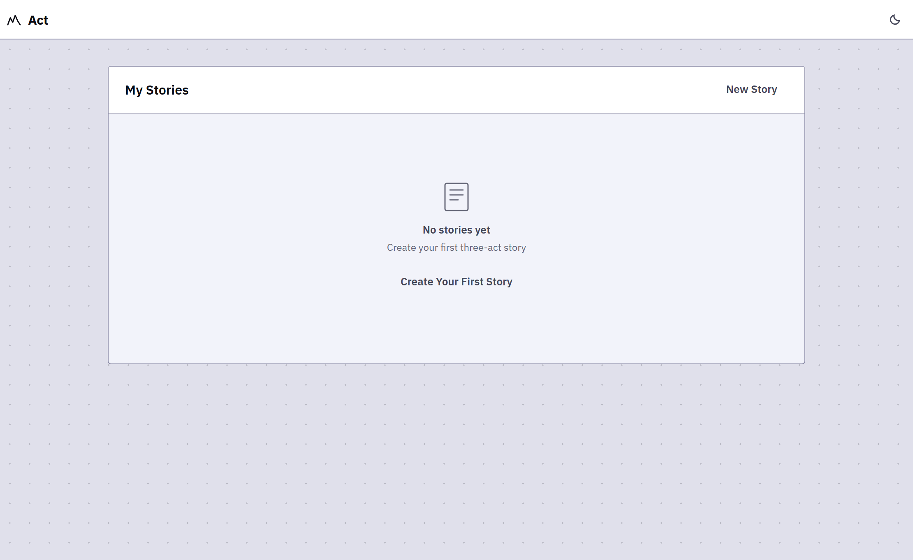

# Act - Story Builder

A modern, **local-first** writing app for screenwriters and storytellers. Build your three-act structure with a clean, distraction-free editor. Write in Markdown, preview your screenplay, and export to PDF, Markdown, or Fountain format—all in your browser, all offline.



[Visit Act now.](https://act.cwright-293.workers.dev/)

## Features

✨ **Three-Act Structure** — Organize your story with acts and scenes. The framework guides without constraining.

✍️ **Rich Text Editor** — Write with bold, italic, underline, headings, and lists. Every keystroke saved instantly.

👁️ **Live Screenplay Preview** — See your content rendered as a proper screenplay in real-time (Fountain format).

📊 **Story Outline** — Quick visual summary of all acts and scenes with summaries.

💾 **Local-First** — Everything lives in your browser via IndexedDB. No accounts, no servers, no syncing hassles.

🎨 **Light, Dark & OLED Modes** — Three carefully crafted themes for any environment. Switches are instant.

📤 **Export Options** — Save your work as Markdown, PDF, or Fountain (industry-standard screenplay format).

⚡ **Instant Responsiveness** — Every action completes in the same frame. No spinners, no waiting.

## Getting Started

### Prerequisites

- **Node.js** 18+ and **npm** (or yarn/pnpm)

### Installation

```bash
# Clone the repo
git clone https://github.com/yourusername/act.git
cd act

# Install dependencies
npm install

# Start the dev server
npm run dev

# Open in your browser
# http://localhost:5173
```

Or open with `npm run dev -- --open` to auto-launch the app.

## Development

### Available Commands

```bash
# Start dev server with hot reload
npm run dev

# Type-check Svelte components and files
npm run check

# Type-check in watch mode
npm run check:watch

# Build for production
npm run build

# Preview production build locally
npm run preview

# Build for Cloudflare Pages
npm run cf-build
```

### Project Structure

```
act/
├── src/
│   ├── routes/              # SvelteKit pages (dashboard, story editor)
│   ├── lib/
│   │   ├── components/      # Reusable UI components
│   │   ├── domain/          # Core story logic
│   │   ├── persistence/     # IndexedDB database layer
│   │   └── stores/          # Svelte stores (theme, app state)
│   └── app.css              # Global styles (Tailwind)
├── static/                  # Static assets
├── svelte.config.js         # SvelteKit configuration
├── vite.config.ts           # Vite bundler config
├── tailwind.config.js       # Tailwind CSS config
└── wrangler.toml            # Cloudflare Pages config
```

## Tech Stack

### Frontend Framework & Build

- **[SvelteKit](https://kit.svelte.dev)** — Full-featured framework for building fast web apps
- **[Svelte 5](https://svelte.dev)** — Reactive UI with minimal boilerplate (runes mode)
- **[Vite](https://vitejs.dev)** — Lightning-fast build tool and dev server
- **[TypeScript](https://www.typescriptlang.org)** — Static typing for safety

### Styling & UI

- **[Tailwind CSS 4](https://tailwindcss.com)** — Utility-first CSS for rapid design
- **IBM Plex Sans** — Warm, humanist sans-serif typeface throughout

### Editor & Content

- **[TipTap](https://www.tiptap.dev)** — Headless rich-text editor (bold, italic, lists, headings)
- **[Fountain.js](https://github.com/mattduvall/fountain-js)** — Parse & render Fountain screenplay syntax
- **[Turndown](https://github.com/domchristie/turndown)** — Convert HTML to Markdown
- **[jsPDF](https://github.com/parallax/jsPDF)** — Generate PDFs in the browser

### Data & Storage

- **[Dexie.js](https://dexie.org)** — IndexedDB wrapper for client-side persistence
- **[nanoid](https://github.com/ai/nanoid)** — Tiny, secure unique ID generator

### Deployment

- **[Cloudflare Pages](https://pages.cloudflare.com)** — Static site hosting with zero-config deployment

## Deployment

Act is ready to deploy to **Cloudflare Pages** (or any static host).

### Deploy to Cloudflare Pages

1. Push to GitHub:
   ```bash
   git push origin main
   ```

2. Connect your repo in [Cloudflare Pages Dashboard](https://pages.cloudflare.com)
   - Build command: `npm run cf-build`
   - Build output directory: `build`

3. Deploy on every push — automatic! 🚀

### Other Platforms

Act works on any static host:
- **Vercel** — Set build to `npm run build`, output to `build`
- **Netlify** — Same as above
- **GitHub Pages** — Same as above

## Design Principles

1. **Words come first** — The editor never gets between you and your writing.
2. **Instant response** — Every action completes immediately. Autosave is silent.
3. **Structure as guide** — The three-act framework is optional scaffolding, not a cage.
4. **Accessibility** — WCAG AA compliant, dark mode, keyboard navigation, reduced motion support.
5. **No clutter** — Every element earns its place.

See [DESIGN.md](DESIGN.md) for the full design system, color palette, and component specifications.

## Browser Support

Act works on all modern browsers:
- Chrome/Edge 90+
- Firefox 88+
- Safari 14+
- Opera 76+

IndexedDB is required for local persistence.

## Contributing

Contributions welcome! Please feel free to submit a Pull Request.

Before submitting:
- Run `npm run check` to type-check
- Test in dev mode with `npm run dev`
- Ensure your changes are tested

## License

This project is licensed under the MIT License — see [LICENSE](LICENSE) for details.

---

[](https://act.pages.dev)
[](https://kit.svelte.dev)
